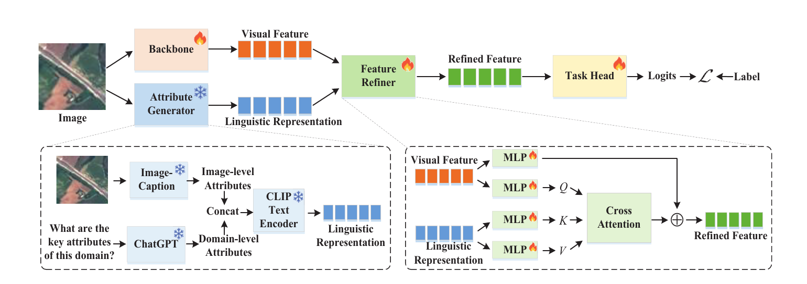

# Language Does Matter for Cross-Domain Few-Shot Visual Feature Enhancement

[](https://openaccess.thecvf.com/content/CVPR2026/html/Zhou_Language_Does_Matter_for_Cross-Domain_Few-Shot_Visual_Feature_Enhancement_CVPR_2026_paper.html)
[](environment.yml)
[](LICENSE)

Code for the cross-domain few-shot semantic segmentation experiments in **Language Does Matter for Cross-Domain Few-Shot Visual Feature Enhancement**.

[[Paper](https://openaccess.thecvf.com/content/CVPR2026/html/Zhou_Language_Does_Matter_for_Cross-Domain_Few-Shot_Visual_Feature_Enhancement_CVPR_2026_paper.html)] [[PDF](https://openaccess.thecvf.com/content/CVPR2026/papers/Zhou_Language_Does_Matter_for_Cross-Domain_Few-Shot_Visual_Feature_Enhancement_CVPR_2026_paper.pdf)]

<p align="center">
  
</p>
<p align="center"><em>Overview of the Attribute Generator and Feature Refiner.</em></p>

## News

- Accepted to CVPR 2026; the CD-FSS code is released in this repository.

## Overview

The method augments visual features with linguistic descriptions at both image and domain levels. BLIP generates an image caption, a frozen CLIP text encoder retains token-level language features, and a residual cross-attention Feature Refiner injects those features into an IFA segmentation model. Source-domain episodic training uses PASCAL VOC, followed by optional target-domain few-shot fine-tuning and evaluation.

## Paper results

The following mIoU (%) values are reported in Table 2 of the paper. They are included for reference and are **not claimed as reproduced by this repository**.

| Method | ISIC 1-shot | ISIC 5-shot | Chest X-Ray 1-shot | Chest X-Ray 5-shot | FSS-1000 1-shot | FSS-1000 5-shot | DeepGlobe 1-shot | DeepGlobe 5-shot | Average 1-shot | Average 5-shot |
|---|---:|---:|---:|---:|---:|---:|---:|---:|---:|---:|
| IFA | 66.3 | 69.8 | 74.0 | 74.6 | 80.1 | 82.4 | 50.6 | 58.8 | 67.8 | 71.4 |
| IFA + Ours | **73.3** | **76.2** | **81.2** | **81.7** | **81.6** | **82.9** | **51.4** | **59.1** | **71.9** | **75.0** |

## Repository structure

```text
.
├── data/                  # Dataset loaders, preprocessing scripts, and tracked splits
├── model/                 # ResNet backbone, IFA, and Feature Refiner
├── scripts/               # Train, fine-tune, and evaluation launchers
├── utils/                 # Runtime, language-model, metric, and checkpoint utilities
├── prompt_train.py        # Source-domain episodic training
├── prompt_finetune.py     # Target-domain few-shot fine-tuning
├── prompt_test.py         # Evaluation and prediction export
├── environment.yml
└── requirements.txt
```

## Installation

Python 3.9 is recommended. Install with either pip or Conda; select a PyTorch build appropriate for the local CUDA runtime rather than relying on a CUDA-specific wheel pinned by this repository.

### pip

```bash
python3.9 -m venv .venv
source .venv/bin/activate
python -m pip install --upgrade pip
pip install -r requirements.txt
```

### Conda

```bash
conda env create -f environment.yml
conda activate ldm-cdfss
```

## Pretrained models

The runtime uses three pretrained components:

- ResNet-50 or ResNet-101 ImageNet weights supplied through `--backbone-weights` during source-domain training. The checkpoint must match this repository's custom dilated ResNet architecture; a standard torchvision ResNet state dict cannot be loaded directly. Wrapped dictionaries with a `state_dict` key and `module.`-prefixed keys are handled.
- `Salesforce/blip-image-captioning-base`, loaded through Hugging Face Transformers.
- CLIP `ViT-B/32`, loaded through `openai-clip`.

BLIP and CLIP are downloaded by their libraries when they are not already cached. No project checkpoint download is currently provided.

Fine-tuning and evaluation initialize the full model from `--checkpoint`; `--backbone-weights` is optional in these two stages. A full-model checkpoint must have been generated with the current Feature Refiner structure. Checkpoints from a different refiner parameter structure are rejected with an explicit error rather than partially loaded. Checkpoints saved with or without `DataParallel` prefixes are accepted.

## Data preparation

Datasets are not redistributed. Arrange the dataset root as follows:

```text
DATA_ROOT/
├── VOC2012/
│   ├── JPEGImages/
│   └── SegmentationClassAug/
├── ISIC/
│   ├── ISIC2018_Task1-2_Training_Input/{1,2,3}/
│   └── ISIC2018_Task1_Training_GroundTruth/
├── Deepglobe/04_train_cat/{1,2,3,4,5,6}/test/
│   ├── origin/
│   └── groundtruth/
├── FSS-1000/fewshot_data/<category>/
└── LungSegmentation/
    ├── CXR_png/
    └── masks/
```

The accepted dataset CLI names are `isic`, `lung` (Chest X-Ray), `fss`, and `deepglobe`. PASCAL and FSS-1000 split files are included under `data/splits/`; `data/isic/class_id.csv` is also tracked. The ISIC and DeepGlobe conversion procedures are provided in `data/preprocess_isic.py` and `data/preprocess_deepglobe.py`; review their relative input and output paths before running them.

## Training

Run commands from the repository root. Source-domain training requires the dataset root and ResNet weights:

```bash
DATA_ROOT=/datasets/cd-fss \
BACKBONE_WEIGHTS=/checkpoints/resnet50.pth \
DATASET=isic SHOT=1 DEVICE=cuda:0 OUTPUT_DIR=outdir/models \
./scripts/train.sh
```

`DATASET` selects the target domain used for validation; source training episodes use PASCAL VOC. The script enables IFA SSP refinement with `--refine`.

## Fine-tuning

Set `CHECKPOINT` to a checkpoint produced by source-domain training:

```bash
DATA_ROOT=/datasets/cd-fss \
CHECKPOINT=/checkpoints/source_model.pth \
DATASET=isic SHOT=1 DEVICE=cuda:0 OUTPUT_DIR=outdir/models \
./scripts/finetune.sh
```

`BACKBONE_WEIGHTS` may also be set, but the full checkpoint replaces model parameters before optimization.

## Evaluation

```bash
DATA_ROOT=/datasets/cd-fss \
CHECKPOINT=/checkpoints/finetuned_model.pth \
DATASET=isic SHOT=1 DEVICE=cuda:0 OUTPUT_DIR=outdir/predictions \
./scripts/evaluate.sh
```

The evaluation entry point runs five seeded episodes by default and writes predicted masks below `OUTPUT_DIR`. For FSS-1000's predefined test split, call `prompt_test.py` directly with `--split test`. Use `python prompt_train.py --help`, `python prompt_finetune.py --help`, and `python prompt_test.py --help` for all options, including batch size, learning rate, episode count, snapshot interval, seed, number of runs, and workers.

## Citation

```bibtex
@InProceedings{Zhou_2026_CVPR,
    author    = {Zhou, Fei and Zhang, Xiwen and Qiu, Qingqing and Zhang, Lei and Wei, Wei and Ding, Chen and Zhang, Yi and Li, Liang and Yue, Xiangyu and Zhang, Yanning},
    title     = {Language Does Matter for Cross-Domain Few-Shot Visual Feature Enhancement},
    booktitle = {Proceedings of the IEEE/CVF Conference on Computer Vision and Pattern Recognition (CVPR)},
    month     = {June},
    year      = {2026},
    pages     = {7946-7956}
}
```

Machine-readable citation metadata is available in [CITATION.cff](CITATION.cff).

## Acknowledgements

This implementation builds on the IFA cross-domain few-shot segmentation workflow and uses PyTorch, torchvision, BLIP, CLIP, Transformers, and the associated dataset benchmarks. We thank their authors and maintainers.

## License

Released under the [MIT License](LICENSE).
